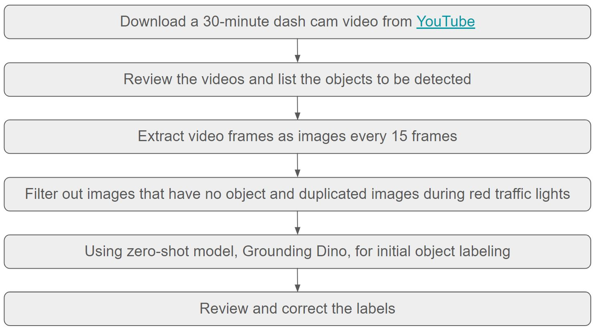
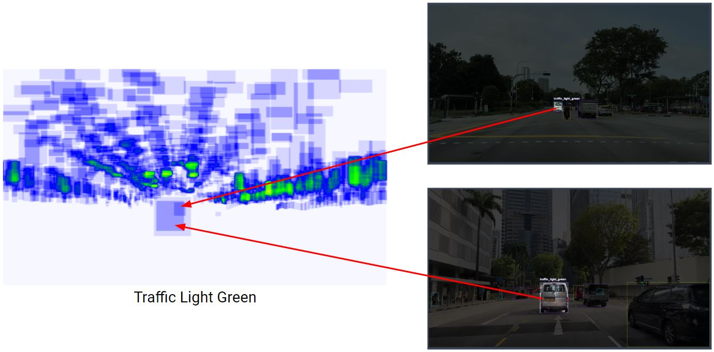
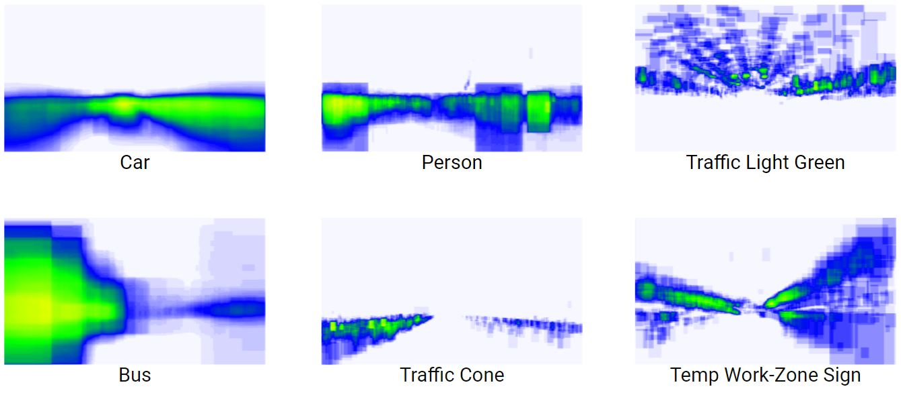
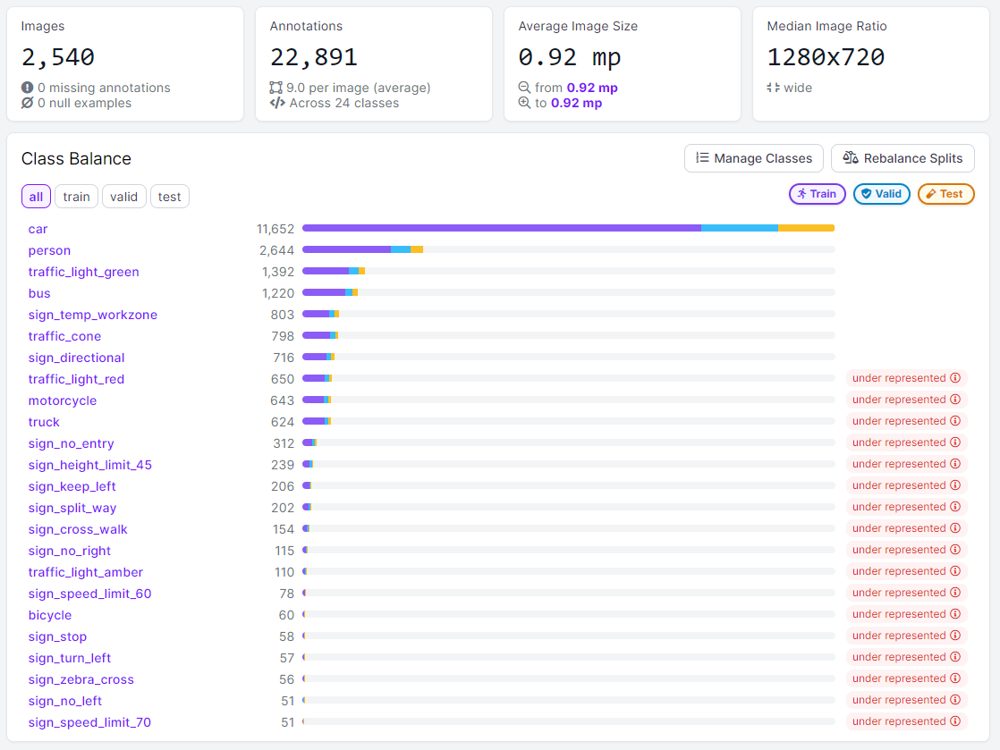
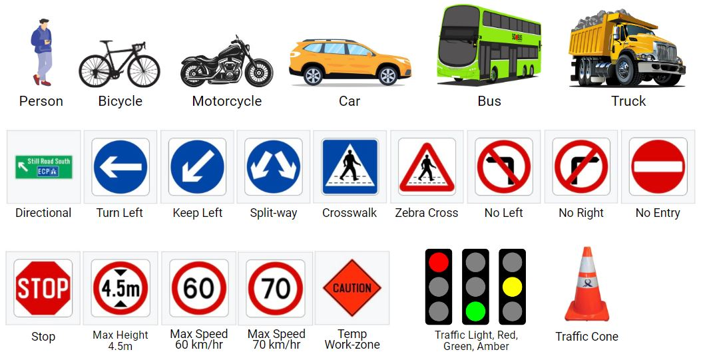
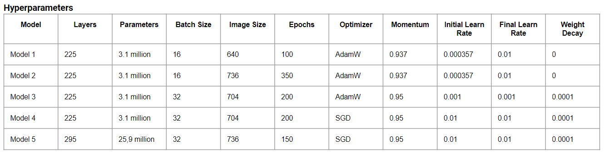
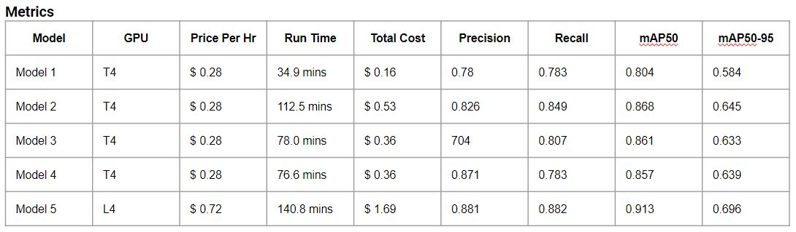

#  Capstone

# DSI-SG-42

## Capstone: Pixel Pilot, Object Detection for Self Driving Car

> Authors: Michael King Sutanto

## Contents

---

- [Problem Statement](#problem-statement)
- [Data Collection](#data-collection)
- [Dataset](#dataset)
- [Modelling](#modelling)
- [Demonstration of Pixel Pilot Kit Predictions](#demonstration-of-pixel-pilot-kit-predictions)
- [Limitations and Recommendations](#limitations-and-recommendations)

---

## Problem Statement
Each country features unique vehicle colors, different types of traffic signs, and various traffic objects. 

How might we develop and integrate an advanced object detection model that can accurately identify Singapore's local vehicles, traffic signs, and traffic-related objects such as traffic cones, into existing car systems, enabling any vehicle to be equipped with reliable self-driving features.

[View Google Slides Presentation](https://docs.google.com/presentation/d/1VGqYOxNk-EMoYRtqRAJrcrpGHPLWjuMUbZlObBw4QhU/edit?usp=sharing)

---

## Data Collection
Here are the links for the videos:  
train video: https://www.youtube.com/watch?v=vBySF9eSKQs  
test video: https://www.youtube.com/watch?v=EXFlYUM5FgI&t=481s

Below is the methodology for data collection

---

## Data Cleaning
After reviewing class heatmaps, I found out that some objects are mislabelled.  
The image is just one of the example, cars are mislabelled as traffic lights green.

Here are the top 6 class heatmaps after cleaning.  
In this observation, the traffic lights consistently appear at the top of the frame, the traffic cones are always at the bottom, and buses are generally located on the left side, appearing larger than other classes.   
Models like YOLO often consider the entire scene (contextual understanding), which helps the system differentiate between objects based on their position and size.

---

## Dataset
This is the clean dataset. It has 2,540 images, 24 classes and 22,891 labels across classes.

---

## Modelling

I used CNN based YOLOv8 for object detection model, it has good accuracy while maintaining a small model size and has fast inference speed.

Below is the models comparison. Model 5 has the best performance with the highest metrics (Precision, Recall, mAP50 and mAP50-95).

---

## Demonstration of Pixel Pilot Kit Predictions
https://youtu.be/_tbwXCWez5k

---

## Conclusion

In conclusion, to accurately identify various obstacles, such as pedestrians, other vehicles, road signs, and objects, to enhance safety and navigation in self-driving cars in Singapore, we can leverage our trained model that specializes in detecting Singapore road obstacles and traffic signs and lights.

---

## Limitations and Recommendations

- **Limitation :**
  - Imbalanced data might cause the model to miss the minority classes or predict with much lower confidence score, leading to lower recall and precision for those classes.

- **Recommendations :**
  - adjust loss weight which can help to address the issue of imbalanced data
  - Gather additional data for under-represented class. 
---

- **Limitation :**
  - The existing dataset contains only daytime data and has less than 20 traffic signs.

- **Recommendations :**
  - Expand the dataset, there are other signs and objects that are not currently included. We also need to include vehicle brake lights so we can anticipate them.
  - Collect night time data and use data augmentation to build a model that's robust across different times of day and weather conditions. 
---

- **Other Recommendation :**
  - Run gridsearch to get best parameters.
  - Test to use tiling windows to detect further or small objects. Divide image into a few smaller tiles, then perform inference on each individual tile. It’s slower but more effective at detecting small objects.
  - Test to use TensorRT to improve inference time/ frame rate. 

